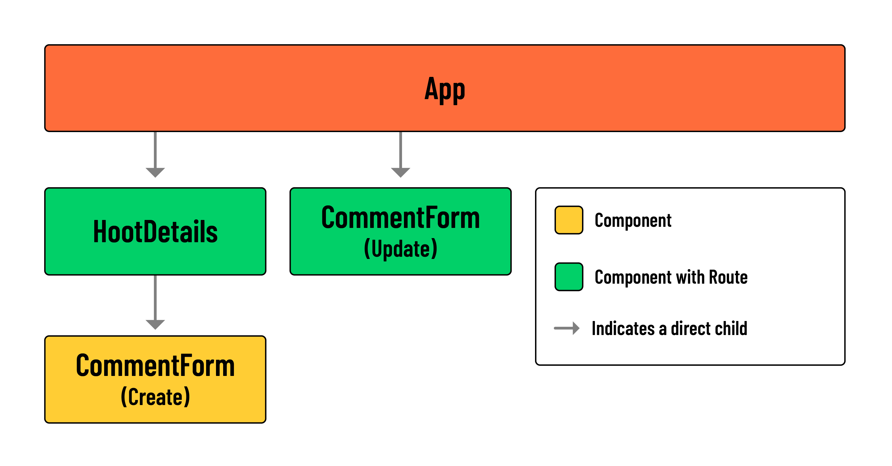

# 

**Learning objective:** By the end of this lesson, students will be able to build functionality for updating and deleting comments.

## Overview

In this lesson, we'll add the functionality for updating and deleting comments. For a few portions of this lesson, you'll be tasked with implementing the solution. This will act as a great opportunity to reinforce your understanding of React. But don't worry, much of the code you will be asked to write will mirror patterns seen elsewhere in this application. Be sure to reference the relevant lessons when necessary.

> 🚨 Note: This lesson assumes that you have completed the steps for updating and deleting comments within your [Express API](https://git.generalassemb.ly/modular-curriculum-all-courses/express-api-hoot-back-end).

## Deleting Comments

Start by implementing the functionality for deleting a comment. This should be a bit easier than handling updates. It will also provide you with several pieces of code that can apply to updates.

### 🎓 You Do: Add the 'Delete' `<button>` for comments

The first step is addressing the UI elements that will trigger the request. In the case of deleting comments, this means adding a 'Delete' `<button>` to each comment in `src/components/HootDetails/HootDetails.jsx`.

Take a look at the code used to render 'Edit' and 'Delete' elements for a `hoot`:

```jsx
// src/components/HootDetails/HootDetails.jsx

<header>
  <p>{hoot.category.toUpperCase()}</p>
  <h1>{hoot.title}</h1>
  <p>
    {hoot.author.username} posted on
    {new Date(hoot.createdAt).toLocaleDateString()}
  </p>
  {hoot.author._id === user._id && (
    <>
      <Link to={`/hoots/${hootId}/edit`}>Edit</Link>
      <button onClick={() => props.handleDeleteHoot(hootId)}>Delete</button>
    </>
  )}
</header>
```

You'll want to mimic this approach for deleting and updating comments.

Take a look at the code block below for reference on where these elements should be placed:

```jsx
// src/components/HootDetails/HootDetails.jsx

{
  hoot.comments.map((comment) => (
    <article key={comment._id}>
      <header>
        <p>
          {comment.author.username} posted on
          {new Date(comment.createdAt).toLocaleDateString()}
        </p>
        // Edit and Delete Comment UI
      </header>
      <p>{comment.text}</p>
    </article>
  ));
}
```

> 🏆 Be sure to include conditional rendering based on the authorship of a `comment`!

### 🎓 You Do: Build the `handleDeleteComment` function

Next, you'll want to add a `handleDeleteComment` function to `src/components/HootDetails/HootDetails.jsx`.

The function should accept a `commentId`, call upon a `deleteComment` service function, and filter `hoot` state accordingly. Don't worry about the `deleteComment` service function for now, we'll address that in the next step.

Start by building the scaffolding for the function, updating the 'Delete' button's event handler, and confirming that you have access to the `commentId` within `handleDeleteComment`:

```jsx
// src/components/HootDetails/HootDetails.jsx

const handleDeleteComment = async (commentId) => {
  console.log("commentId:", commentId);
};
```

With access to the `commentId`, you should be able to `filter()` local state:

```jsx
// src/components/HootDetails/HootDetails.jsx

const handleDeleteComment = async (commentId) => {
  console.log("commentId:", commentId);
  // Eventually the service function will be called upon here
  setHoot({
    ...hoot,
    comments: hoot.comments.filter((comment) => comment._id !== commentId),
  });
};
```

> 🚨 Remember, for these changes to persist, we'll eventually need to update our database!

### 🎓 You Do: Build the service function

Next, add a `deleteComment` service function to `src/services/hootService.js`. Like `createComment`, `deleteComment` will utilize the same `BASE_URL` as other hoot and comment related services.

The service function should accept both a `hootId` and a `commentId`. Use previous service functions as reference to help you build this out.

```jsx
const deleteComment = async (hootId, commentId) => {
  ...
};
```

> 💡 Check your backend routes if you have trouble with this step. Based on the structure of previous service functions, making a request to `${BASE_URL}/${hootId}/comments/${commentId}` would be appropriate.

### 🎓 You Do: Call upon the service

With the service in place, return to `src/components/HootDetails/HootDetails.jsx` to finish up your `handleDeleteComment` function.

```jsx
const handleDeleteComment = async (commentId) => {
  console.log("commentId:", commentId);
  // Call upon hootService.deleteComment here!
  setHoot({
    ...hoot,
    comments: hoot.comments.filter((comment) => comment._id !== commentId),
  });
};
```

> 💡 When calling upon `hootService.deleteComment()`, remember to pass in `hootId` and `commentId`.

## Updating comments

The functionality for updating comments will mirror that of updating hoots quite closely. Be sure to review that lesson before moving on.

As we saw with updating hoots, the same form component can be used to create and update a resource. We'll take the same approach with our `src/components/CommentForm/CommentForm.jsx`.

Take a look at the diagram below for context on how the update comment `CommentForm` will fit into our component tree:



> 💡 Notice how one instance of `src/components/CommentForm/CommentForm.jsx` is treated as a standard child component, while the other is treated as a 'page', with its own route.

### 🎓 You Do: Add the 'Edit' `<Link>` for comments

As always, start out with the UI element.

In `src/components/HootDetails/HootDetails.jsx`, add an 'Edit' `<Link>` that directs a user to the 'Edit Comment' page. The `<Link>` should be placed directly above the 'Delete' comment `<button>`.

The `to` prop of your `<Link>` should have the following value:

```js
`/hoots/${hootId}/comments/${comment._id}/edit`;
```

After you add the `<Link>`, head over to `src/App.jsx` to build out the **corresponding client-side route**.

Remember to import the component inside `src/App.jsx`:

```jsx
// src/App.jsx

import CommentForm from "./components/CommentForm/CommentForm";
```

And add the following protected route:

```jsx
// src/App.jsx

<Route
  path="/hoots/:hootId/comments/:commentId/edit"
  element={<CommentForm />}
/>
```

> 💡 Notice the inclusion of `:hootId` and `:commentId`. These parameters will be important for the next step.

In the next section, we'll access the value of this `hootId` parameter with the `useParams()` hook.

### Modify the `CommentForm`

Next we'll need to modify `src/components/CommentForm/CommentForm.jsx` so that it can be used in two different contexts (creating comments and updating comments).

Open up `src/components/CommentForm/CommentForm.jsx` and import `useParams` and from `'react-router'`:

```jsx
// src/components/CommentForm/CommentForm.jsx

import { useParams } from "react-router";
```

Within the component, call upon `useParams()` to access the `hootId` **and** the `commentId`:

```jsx
// // src/components/HootForm/HootForm.jsx

const { hootId, commentId } = useParams();
```

With a `console.log()`, verify that you can access the params.

### Set `formData` state

Next, we'll use the params from the step above to fetch the necessary data for `formData` state.

Our backend does not have a dedicated controller for retrieving a specific comment, but the existing `show` functionality for hoots should work well in this scenario.

Within a `useEffect`, we can call upon `hootService.show()`. The `hoot` object issued as a response will contain the comment we need, which can be located by calling `Array.prototype.find()` on `hoot.comments`. The resulting comment data can be stored in `formData` state.

At the top of `src/components/CommentForm/CommentForm.jsx`, add imports for `hootService` and `useEffect`:

```jsx
import { useState, useEffect } from "react";
import * as hootService from "../../services/hootService";
```

Add the following `useEffect()`:

```jsx
// src/components/CommentForm/CommentForm.jsx

useEffect(() => {
  const fetchHoot = async () => {
    const hootData = await hootService.show(hootId);
    // Find comment in fetched hoot data
    setFormData(hootData.comments.find((comment) => comment._id === commentId));
  };
  if (hootId && commentId) fetchHoot();
}, [hootId, commentId]);
```

Take a moment to confirm that the initial state of `formData` is being set correctly when editing a comment.

> 💡 Note the above `if` condition and inclusion of `hootId` and `commentId` in our effect's dependency array. Our effect will only call upon `fetchHoot` if both of these pieces of data are present. Otherwise, we can assume the component is being used to create a brand new comment, in which case `formData` state should maintain its initial value.

### Build the service function

Next we'll build the `updateComment` service function.

Our `updateComment` service function will accept three parameters:

1. A `hootId` for locating the parent document.
2. A `commentId` for locating the embedded subdocument.
3. And `commentFormData` for updating properties of the embedded subdocument.

Add the following to `src/services/hootService.js`:

```js
// src/services/hootService.js

const updateComment = async (hootId, commentId, commentFormData) => {
  try {
    const res = await fetch(`${BASE_URL}/${hootId}/comments/${commentId}`, {
      method: "PUT",
      headers: {
        Authorization: `Bearer ${localStorage.getItem("token")}`,
        "Content-Type": "application/json",
      },
      body: JSON.stringify(commentFormData),
    });
    return res.json();
  } catch (error) {
    console.log(error);
  }
};
```

### Call upon the service

The final step is to modify your `handleSubmit` function by calling upon `hootService.updateComment`.

Remember, this function is also responsible for adding comments, so we'll require an `if...else` block to switch between two services.

Our `if` condition should check for both a `hootId` and a `commentId`. If both pieces of data are present, we can call upon `hootService.updateComment` and `navigate()` the user back to `/hoots/${hootId}`. Otherwise, we should call upon `props.handleAddComment(formData)`, with no redirect.

Note, after updating a comment, the user will be redirected back to the hoot 'Details' page. This will cause the `hootService.show(hootId)` function to fire off again, thus updating state with whatever changes were made to our backend.

As a result, **we don't need to worry about state management when updating a comment**. Additionally, our `updateComment` service function can be called upon directly inside `handleSubmit` function of `src/components/CommentForm/CommentForm.jsx`.

In `src/components/CommentForm/CommentForm.jsx`, update `handleSubmit` with the following:

```jsx
// src/components/CommentForm/CommentForm.jsx

const handleSubmit = (evt) => {
  evt.preventDefault();
  if (hootId && commentId) {
    hootService.updateComment(hootId, commentId, formData);
    navigate(`/hoots/${hootId}`);
  } else {
    props.handleAddComment(formData);
  }
  setFormData({ text: "" });
};
```
